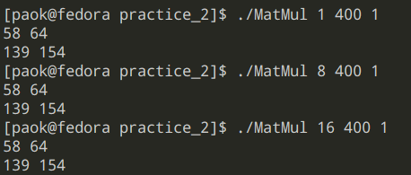

# Parallelized Matrix Multiplication using OpenMP
**Student:** Pablo Agustín Ortega Kral - A00344664

The objective of this lab was to a code in C that multiplies two matrixes of any size, provided these can be multiplied, and then use **OpenMP** to parallelize this operation. OpenMP is an API for shared-memory parallel programming in C and C++ .

To validate the given approach, the code was tested for a small operation whose result was known.

$$
\begin{align}
    \begin{bmatrix} 1 && 2 &&3 
    \\ 4  &&  2  &&  6  \end{bmatrix} 
    *
    \begin{bmatrix} 7 && 8 \\ 
    9 && 10 \\
    11 && 12\end{bmatrix} 
    =
    \begin{bmatrix} 
    58 && 64 \\
    139 && 159\end{bmatrix}
    \end{align}
$$



*Validation for 1,8 and 16 threads*

To compile this project run the **make** command. The binary can be erased by running **make clean**. The compiled binary takes as arguments the number of threads, the size of the square test matrixes and a flag that indicates if the result wishes to be printed or not.
For instance, the following example multiplies two 300x300 matrixes using 8 threads. An printing the result.
```
./MatMul 8 300 1
```

# Performance testing
To test this approach a function was written to generate random matrixes given a size.

The code was tested for 300X300 matrixes using 1 to 4 and 13 to 16 threads. 64, 1000 and 4096 threads were also used to test what will happen if the number of cores of the CPU is exceeded (in this case the tested CPU had 8 physical cores, 16 virtual cores).

An average of 4 executions was taken for a more indicative result.


_#Note:_ A testing bash script was included, to use first compile using the Makefile and specify the range of threads to be tested and the size of the matrixes like so

```
./test_suit.sh 1 16 300
```
## CPU Usage
To verify that the threads are indeed running  separate on cores we can use a system monitoring tool such as **htop** to verify the CPU usage. By doing this, we can see that the load gets distributed between different cores. Here we showcase a 3000x3000 matrix multiplication using 1 vs 16 threads. We can clearly see that when running this demanding task on only one thread we saturate one core of the CPU (here core 14), forcing it to work at 100% capacity, whereas when we distribute the load all cores are used 

*1 Thread*

*16 Threads*
# Conclusion

OpenMP provides an easy way form parallelizing blocks of code with the _pragma_ preprocessor directive, creating a team of threads that execute the specified directions. It offers options for different modalities of parallel programming, the one implemented here uses _parallel for_ to distribute the operations within the loop in the created threads. OpenMP also introduces _scopes_ to indicate how to handle variables between the threads: using _private_ to indicate which are specific to each threads; _shared_ to indicate global variables and prevent race conditions. It also includes ways to ensure that operations that require to be executed after all threads finish do so, like _reduction, used here to ensure the sum in each element of the matrix is not missing any terms.

Regarding performance, we can see that incrementing the threads from 1 (not parallel programing) to 4 yields a great performance benefit; however, the difference isn't has great from 13 to 16 noticing negligible decreases in run time. When running with more threads than available cores we see that performance actually worsens, with extreme cases such as 4096 threads yielding more time than not using parallel programming, this is because the amount of threads overwhelms the CPU scheduler and operations spend more time in the waiting queue than actually executing